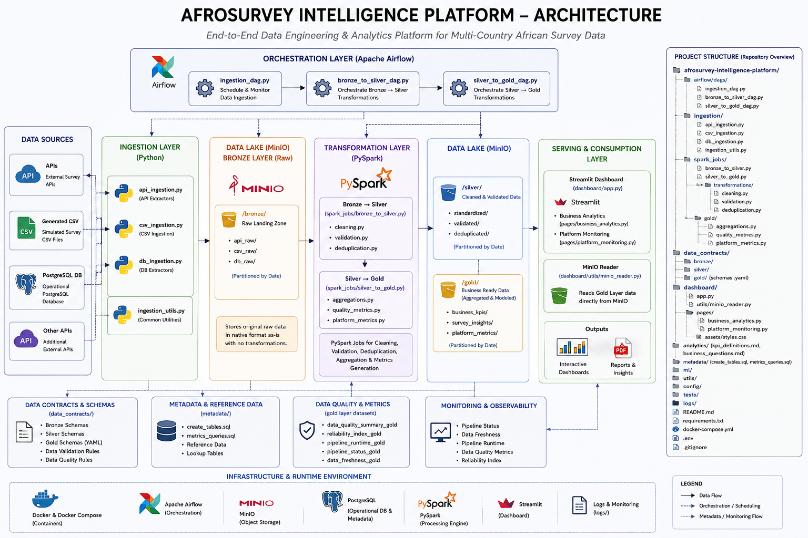
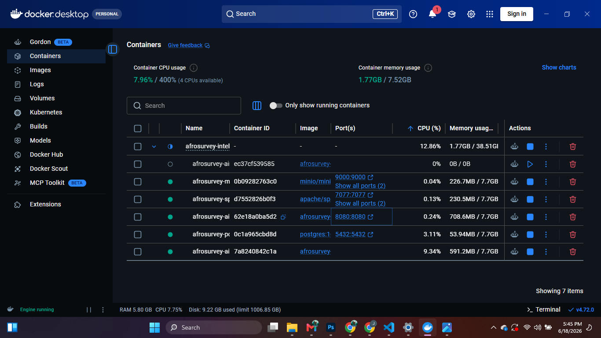
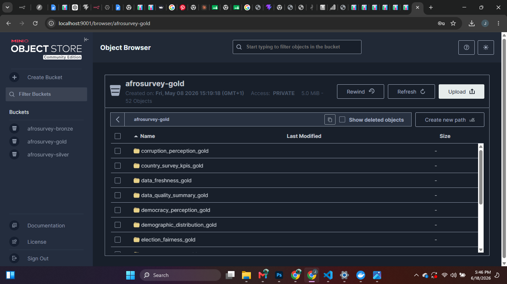
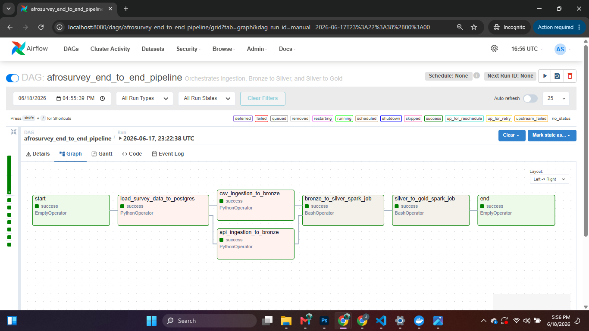
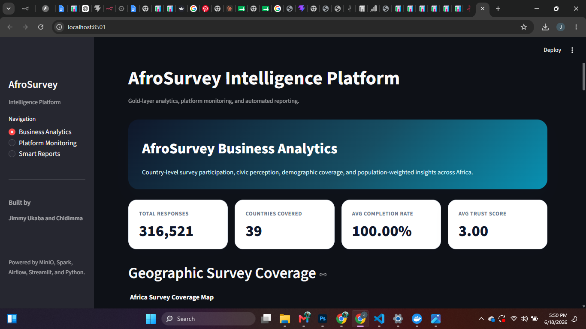
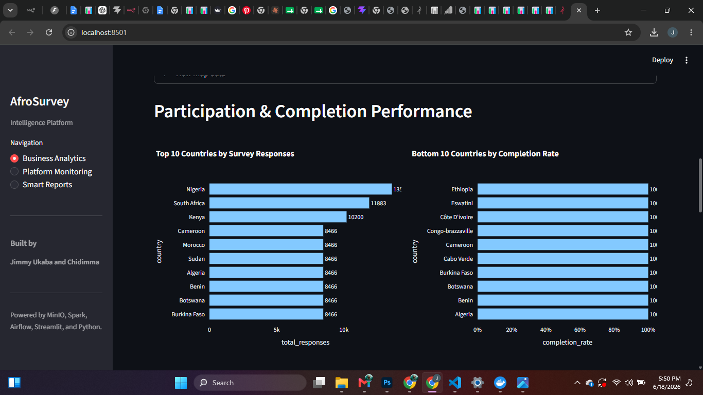
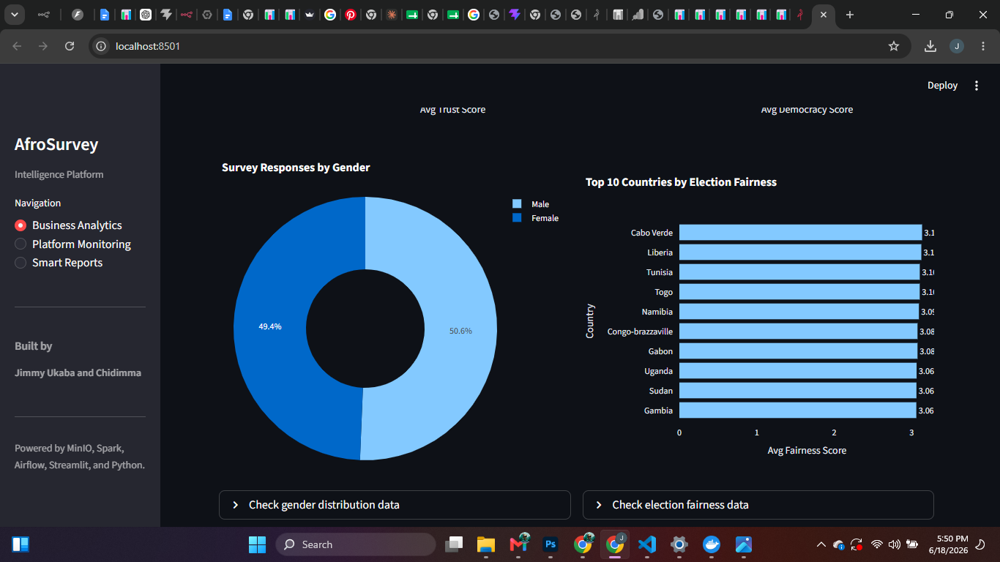

# AfroSurvey Intelligence Platform

### Production-Style Data Lakehouse & Analytics Platform for Multi-Country African Survey Data


AfroSurvey Intelligence Platform is an end-to-end Data Engineering solution designed to ingest, validate, transform, monitor, and analyze survey data collected across multiple African countries.

Built using modern data engineering principles, the platform implements a Bronze → Silver → Gold lakehouse architecture with automated orchestration, data quality monitoring, business analytics dashboards, and automated reporting capabilities.

### Key Features

* Multi-source data ingestion (CSV, APIs, Database Sources)
* Bronze → Silver → Gold Data Lakehouse Architecture
* Data Validation & Quality Monitoring Framework
* Automated Workflow Orchestration with Apache Airflow
* S3-Compatible Object Storage with MinIO
* PySpark-Based Data Transformation Pipelines
* Business Analytics Dashboard
* Platform Monitoring Dashboard
* Automated PDF & Executive Reporting
* Containerized Deployment with Docker

### Project Highlights

* 39 African Countries Analyzed
* Automated End-to-End Data Pipeline
* Data Quality & Reliability Monitoring

## Project Overview

AfroSurvey Intelligence Platform is a production-style data lakehouse and analytics solution built to process, monitor, and analyze survey data collected across multiple African countries.

The platform was designed to address common challenges faced by organizations managing large-scale survey operations, including fragmented data sources, inconsistent data quality, limited visibility into pipeline performance, and delayed reporting.

Using a modern Bronze → Silver → Gold architecture, the platform ingests raw survey data from multiple sources, applies validation and transformation rules, generates business-ready analytical datasets, and delivers actionable insights through interactive dashboards and automated reporting.

The solution combines data engineering, data quality management, workflow orchestration, business intelligence, and platform monitoring into a single integrated system.

### Core Objectives

* Centralize survey data from multiple sources.
* Improve data quality through validation and governance checks.
* Automate ingestion, transformation, and reporting workflows.
* Provide business stakeholders with real-time analytics and insights.
* Monitor platform health, pipeline performance, and data reliability.
* Enable scalable analytics across multiple African countries.


## Business Problem

Organizations conducting surveys across multiple countries often face significant operational and analytical challenges.

Survey responses may originate from different systems, formats, and collection channels, making it difficult to maintain consistency, trust, and visibility across the data lifecycle. As data volumes grow, manual validation processes become inefficient, reporting cycles become slower, and stakeholders struggle to obtain reliable insights in a timely manner.

Key challenges include:

* Inconsistent survey data formats across countries and collection channels.
* Missing, incomplete, or duplicate survey responses.
* Limited visibility into data quality and pipeline health.
* Slow turnaround time for business reporting and decision-making.
* Difficulty measuring survey coverage and participation across regions.
* Lack of centralized monitoring for ingestion and transformation workflows.

AfroSurvey Intelligence Platform addresses these challenges by implementing a scalable lakehouse architecture, automated data quality framework, workflow orchestration, business analytics dashboards, and platform monitoring capabilities that transform raw survey responses into trusted, actionable insights.

* Business Intelligence & Civic Perception Analytics
* Production-Style Data Engineering Architecture

## Architecture




The platform follows a layered lakehouse architecture that separates raw ingestion, cleaned datasets, business-ready analytics, and reporting outputs.

Data flows through the following stages:

1. **Source Layer** — CSV files, REST APIs, and database sources.
2. **Ingestion Layer** — Python ingestion scripts collect and validate incoming data.
3. **Bronze Layer** — Raw data is stored in MinIO as the landing zone.
4. **Silver Layer** — Data is cleaned, standardized, validated, and deduplicated.
5. **Gold Layer** — Aggregated analytics tables are created for reporting and dashboards.
6. **Serving Layer** — Streamlit dashboards and automated reports consume Gold datasets.
7. **Monitoring Layer** — Airflow, pipeline logs, and platform metrics track performance and reliability.

## Technology Stack

| Layer | Technology |
|---|---|
| Programming Language | Python |
| Data Processing | PySpark, Pandas |
| Workflow Orchestration | Apache Airflow |
| Object Storage | MinIO |
| Database | PostgreSQL |
| Dashboard & Visualization | Streamlit, Plotly |
| Reporting | PDF generation, Email reporting |
| Containerization | Docker, Docker Compose |
| Data Contracts | YAML |
| Version Control | Git, GitHub |
| Development Environment | VS Code, DBeaver |


## Project Structure

The platform is organized into modular layers that separate orchestration, ingestion, transformation, analytics, monitoring, and reporting responsibilities.

```text
afrosurvey-intelligence-platform/
│
├── airflow/           # Workflow orchestration
├── ingestion/         # Data ingestion pipelines
├── spark_jobs/        # PySpark transformations & aggregations
├── data_contracts/    # Bronze, Silver & Gold schemas
├── dashboard/         # Business analytics dashboards
├── reporting/         # Automated reporting services
├── metadata/          # Pipeline metadata & metrics
├── config/            # Configuration files
├── tests/             # Testing scripts
├── utils/             # Shared utilities & logging
│
├── docker-compose.yml
├── requirements.txt
└── README.md
```

### Key Components

* **Airflow** – Orchestrates ingestion and transformation workflows.
* **Ingestion Layer** – Extracts survey data from APIs, CSV files, and PostgreSQL.
* **PySpark Layer** – Performs cleaning, validation, deduplication, and Gold-layer aggregations.
* **Data Contracts** – Defines schemas and validation rules for Bronze, Silver, and Gold datasets.
* **Dashboard Layer** – Provides business analytics, platform monitoring, and reporting interfaces.
* **Reporting Layer** – Generates automated reports and executive summaries.
* **Metadata Layer** – Stores pipeline metrics, runtime information, and operational metadata.

```
```


---

## 7. Infrastructure

This is where you add **Docker, MinIO, and Airflow screenshots**.

## Infrastructure

The platform runs on a containerized local data engineering environment using Docker Compose. The infrastructure includes object storage, metadata storage, orchestration, processing, and dashboard components.

### Docker Environment

Docker Compose is used to run the core platform services required for local development and testing.



### MinIO Object Storage

MinIO acts as an S3-compatible object storage layer for the data lakehouse. It stores raw, cleaned, and business-ready datasets across Bronze, Silver, and Gold zones.



### Apache Airflow Orchestration

Apache Airflow orchestrates the pipeline workflows, including ingestion checks, transformation jobs, and pipeline monitoring tasks.




## Technology Stack

| Layer | Technology |
|---|---|
| Programming Language | Python |
| Data Processing | PySpark, Pandas |
| Workflow Orchestration | Apache Airflow |
| Object Storage | MinIO |
| Database | PostgreSQL |
| Dashboard & Visualization | Streamlit, Plotly |
| Reporting | PDF generation, Email reporting |
| Containerization | Docker, Docker Compose |
| Data Contracts | YAML |
| Version Control | Git, GitHub |
| Development Environment | VS Code, DBeaver |


## Data Pipeline

The platform implements a modern Bronze → Silver → Gold lakehouse architecture designed to transform raw survey data into trusted, business-ready analytical datasets.

### Bronze Layer (Raw Data)

The Bronze layer serves as the landing zone for all incoming survey data. Data is ingested from multiple sources and stored in its original format without modification.

**Sources**

* External APIs
* Generated survey CSV files
* PostgreSQL operational database

**Objectives**

* Preserve source data
* Enable auditability
* Support replay and recovery

### Silver Layer (Cleaned & Standardized Data)

The Silver layer applies data quality and transformation rules to prepare datasets for analytics.

**Processing Activities**

* Data cleaning
* Schema validation
* Standardization
* Duplicate detection
* Missing value checks

**Technology**

* PySpark
* YAML Data Contracts

### Gold Layer (Business-Ready Analytics)

The Gold layer contains aggregated datasets optimized for reporting, dashboards, and business decision-making.

**Gold Datasets**

* Country Survey KPIs
* Demographic Distribution
* Response Volume Trends
* Governance Trust Metrics
* Democracy Perception Metrics
* Corruption Perception Metrics
* Election Fairness Metrics
* Population Coverage Metrics
* Data Quality Metrics
* Pipeline Monitoring Metrics

The Gold layer serves as the primary source for business analytics dashboards and automated reporting.


## Data Quality Framework

Ensuring data quality is a critical requirement for large-scale survey analytics. The platform incorporates a dedicated quality framework that validates data at multiple stages of the pipeline.

### Validation Rules

The platform performs:

* Schema validation
* Data type validation
* Required field validation
* Duplicate detection
* Missing value analysis
* Standardization checks
* Freshness monitoring

### Data Contracts

YAML-based data contracts define:

* Expected schemas
* Mandatory fields
* Business rules
* Validation constraints

### Quality Metrics Generated

The platform calculates and monitors:

* Validation Pass Rate
* Duplicate Response Rate
* Missing Data Rate
* Data Freshness
* Pipeline Reliability Index

### Benefits

The framework ensures that business users and analysts work with trusted, consistent, and reliable datasets while providing visibility into data health across the entire pipeline lifecycle.


## Business Analytics Dashboard

The Business Analytics Dashboard provides stakeholders with interactive visualizations and KPIs derived from Gold-layer datasets.

The dashboard enables users to monitor survey participation, coverage, governance perceptions, demographic distributions, and civic sentiment across multiple African countries.

### Dashboard Overview



### Key Performance Indicators

The dashboard provides high-level metrics including:

* Total Survey Responses
* Countries Covered
* Average Completion Rate
* Average Population Coverage

### Geographic Survey Coverage

The platform visualizes survey coverage across participating African countries, allowing stakeholders to identify regions with strong or weak representation.


### Participation & Completion Analysis

Survey participation and completion metrics help identify engagement levels across countries.




Population Coverage Analysis
Measures survey reach relative to national population sizes.
Civic Perception Insights

The platform provides analytics on:

* Governance Trust
* Democracy Satisfaction
* Election Fairness
* Demographic Distribution


### Business Value

These insights help policymakers, researchers, and organizations understand public sentiment, identify participation gaps, and make data-driven decisions.


## Platform Monitoring Dashboard

The Platform Monitoring Dashboard provides operational visibility into the health, performance, and reliability of the data platform.

The dashboard is powered by metadata generated throughout the pipeline and supports proactive monitoring of ingestion, transformation, and reporting workflows.

### Platform Monitoring Overview


### Pipeline Runtime Monitoring

Tracks execution duration across ingestion and transformation stages.

Monitored Metrics:

* Runtime Duration
* Records Processed
* Throughput
* Processing Efficiency

### Pipeline Status Monitoring

Provides visibility into workflow execution outcomes.

Status Categories:

* Success
* Failed
* Running
* Retried

### Data Freshness Monitoring

Measures the time between data collection and analytical availability.

Tracked Metrics:

* Latest Submission Date
* Freshness Lag
* Country-Level Freshness

### Reliability Monitoring

The platform generates a reliability index that combines:

* Validation Success Rate
* Duplicate Detection Results
* Missing Data Rates
* Pipeline Success Rates

### Operational Benefits

* Faster issue detection
* Improved pipeline observability
* Increased trust in analytical outputs
* Reduced reporting delays
* Better operational decision-making


## Automated Reporting


The platform includes an automated reporting layer that transforms analytical outputs into stakeholder-friendly reports and summaries.

The reporting module consumes Gold-layer datasets and generates insights that can be shared with executives, analysts, and operational teams.

### Reporting Components

* PDF Report Generation
* Executive Summary Generation
* Chart Export Services
* Email Report Distribution

### Reporting Workflow

```text
Gold Layer Data
       ↓
Summary Generator
       ↓
Chart Exporter
       ↓
PDF Generator
       ↓
Email Reporter
       ↓
Stakeholders
```

### Generated Outputs

The platform can produce:

* Country Performance Reports
* Survey Participation Reports
* Data Quality Reports
* Governance & Democracy Insights Reports
* Executive Summaries

### Benefits

* Reduces manual reporting effort
* Improves decision-making speed
* Standardizes reporting outputs
* Enables automated stakeholder communication

```
```

## Business Questions Answered

The platform was designed to answer key business and operational questions related to survey performance, data quality, and public sentiment across African countries.

### Survey Participation & Coverage

1. Which countries have the highest survey participation rates?
2. Which countries have the lowest completion rates?
3. How effectively does survey coverage represent national populations?
4. Which countries generate the highest response volumes?

### Data Quality & Reliability

5. What is the overall data quality score across countries?
6. What percentage of responses are duplicates?
7. Which datasets contain the highest levels of missing data?
8. How reliable is the platform based on validation and freshness metrics?

### Governance & Civic Perception

9. Which countries exhibit the highest governance trust scores?
10. How satisfied are respondents with democratic processes?
11. How is corruption perceived across participating countries?
12. Which countries are perceived to have the fairest elections?

### Platform Operations

13. How healthy and reliable are the data pipelines?
14. Are datasets being refreshed within expected timeframes?
15. Which pipeline stages contribute most to runtime delays?

By answering these questions, the platform enables stakeholders to make informed decisions based on trusted, high-quality survey data.


## Getting Started

### Prerequisites

Before running the platform, ensure the following tools are installed:

* Python 3.10+
* Docker & Docker Compose
* Apache Airflow
* PostgreSQL
* MinIO
* Git

### Clone the Repository

```bash
git clone https://github.com/jimmyukaba1234-prog/afrosurvey-intelligence-platform.git
cd afrosurvey-intelligence-platform
```

### Install Dependencies

```bash
pip install -r requirements.txt
```

### Start Infrastructure Services

```bash
docker compose up -d
```

### Run Airflow Pipelines

Trigger the required DAGs from the Airflow UI or scheduler.

### Launch the Dashboard

```bash
streamlit run dashboard/app.py
```

### Access Services

| Service             | URL                   |
| ------------------- | --------------------- |
| Streamlit Dashboard | http://localhost:8501 |
| Airflow             | http://localhost:8080 |
| MinIO Console       | http://localhost:9001 |
| PostgreSQL          | localhost:5432        |

The platform is now ready for ingestion, transformation, analytics, monitoring, and reporting.


## Future Improvements

The current implementation provides a production-style foundation for survey analytics. Future enhancements may include:

### Data Engineering

* Real-time streaming ingestion with Kafka
* Incremental processing pipelines
* Data versioning and lineage tracking
* Automated schema evolution

### Data Quality

* Great Expectations integration
* Advanced anomaly detection
* Automated quality alerting
* Enhanced governance controls

### Analytics & Reporting

* Predictive analytics and forecasting
* Country benchmarking models
* Advanced executive reporting
* Self-service analytics capabilities

### Cloud & DevOps

* Azure Data Engineering deployment
* CI/CD pipeline implementation
* Infrastructure as Code (Terraform)
* Kubernetes deployment

### Machine Learning

* Survey response classification
* Sentiment analysis models
* Response prediction models
* Recommendation systems for policy insights


## Authors

### Jimmy Ukaba

**Data Engineer | Analytics Engineer | AI Automation Engineer**

Jimmy led the design and implementation of the platform architecture, data ingestion pipelines, PySpark transformation workflows, data quality framework, analytics dashboards, platform monitoring capabilities, and reporting components.

---

### Chidimma Onyeri

**Data Analyst | Business Analytics Contributor**

Chidimma contributed to the analytical design, business questions framework, KPI definition, dashboard insight requirements, and business-focused reporting perspectives that informed the analytical outputs of the platform.

---

### Acknowledgements

This project was developed as a production-style data engineering and analytics platform to demonstrate modern data architecture principles, workflow orchestration, data quality management, monitoring, and business intelligence capabilities using open-source technologies.
