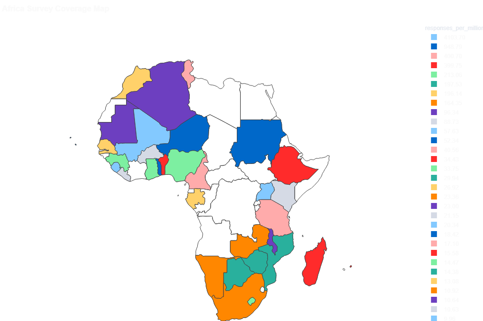

# AfroSurvey Intelligence Platform

### Production-Style Data Lakehouse & Analytics Platform for Multi-Country African Survey Data

AfroSurvey Intelligence Platform is an end-to-end Data Engineering solution designed to ingest, validate, transform, monitor, and analyze survey data collected across multiple African countries.

Built using modern data engineering principles, the platform implements a Bronze → Silver → Gold lakehouse architecture with automated orchestration, data quality monitoring, business analytics dashboards, and automated reporting capabilities.

### Key Features

* Multi-source data ingestion (CSV, APIs, Database Sources)
* Bronze → Silver → Gold Data Lakehouse Architecture
* Data Validation & Quality Monitoring Framework
* Automated Workflow Orchestration with Apache Airflow
* S3-Compatible Object Storage with MinIO
* PySpark-Based Data Transformation Pipelines
* Business Analytics Dashboard
* Platform Monitoring Dashboard
* Automated PDF & Executive Reporting
* Containerized Deployment with Docker

### Project Highlights

* 39 African Countries Analyzed
* Automated End-to-End Data Pipeline
* Data Quality & Reliability Monitoring

## Project Overview

AfroSurvey Intelligence Platform is a production-style data lakehouse and analytics solution built to process, monitor, and analyze survey data collected across multiple African countries.

The platform was designed to address common challenges faced by organizations managing large-scale survey operations, including fragmented data sources, inconsistent data quality, limited visibility into pipeline performance, and delayed reporting.

Using a modern Bronze → Silver → Gold architecture, the platform ingests raw survey data from multiple sources, applies validation and transformation rules, generates business-ready analytical datasets, and delivers actionable insights through interactive dashboards and automated reporting.

The solution combines data engineering, data quality management, workflow orchestration, business intelligence, and platform monitoring into a single integrated system.

### Core Objectives

* Centralize survey data from multiple sources.
* Improve data quality through validation and governance checks.
* Automate ingestion, transformation, and reporting workflows.
* Provide business stakeholders with real-time analytics and insights.
* Monitor platform health, pipeline performance, and data reliability.
* Enable scalable analytics across multiple African countries.

## Business Problem

Organizations conducting surveys across multiple countries often face significant operational and analytical challenges.

Survey responses may originate from different systems, formats, and collection channels, making it difficult to maintain consistency, trust, and visibility across the data lifecycle. As data volumes grow, manual validation processes become inefficient, reporting cycles become slower, and stakeholders struggle to obtain reliable insights in a timely manner.

Key challenges include:

* Inconsistent survey data formats across countries and collection channels.
* Missing, incomplete, or duplicate survey responses.
* Limited visibility into data quality and pipeline health.
* Slow turnaround time for business reporting and decision-making.
* Difficulty measuring survey coverage and participation across regions.
* Lack of centralized monitoring for ingestion and transformation workflows.

AfroSurvey Intelligence Platform addresses these challenges by implementing a scalable lakehouse architecture, automated data quality framework, workflow orchestration, business analytics dashboards, and platform monitoring capabilities that transform raw survey responses into trusted, actionable insights.

* Business Intelligence & Civic Perception Analytics
* Production-Style Data Engineering Architecture

## Architecture

The platform follows a layered lakehouse architecture that separates raw ingestion, cleaned datasets, business-ready analytics, and reporting outputs.

Data flows through the following stages:

1. **Source Layer** — CSV files, REST APIs, and database sources.
2. **Ingestion Layer** — Python ingestion scripts collect and validate incoming data.
3. **Bronze Layer** — Raw data is stored in MinIO as the landing zone.
4. **Silver Layer** — Data is cleaned, standardized, validated, and deduplicated.
5. **Gold Layer** — Aggregated analytics tables are created for reporting and dashboards.
6. **Serving Layer** — Streamlit dashboards and automated reports consume Gold datasets.
7. **Monitoring Layer** — Airflow, pipeline logs, and platform metrics track performance and reliability.
